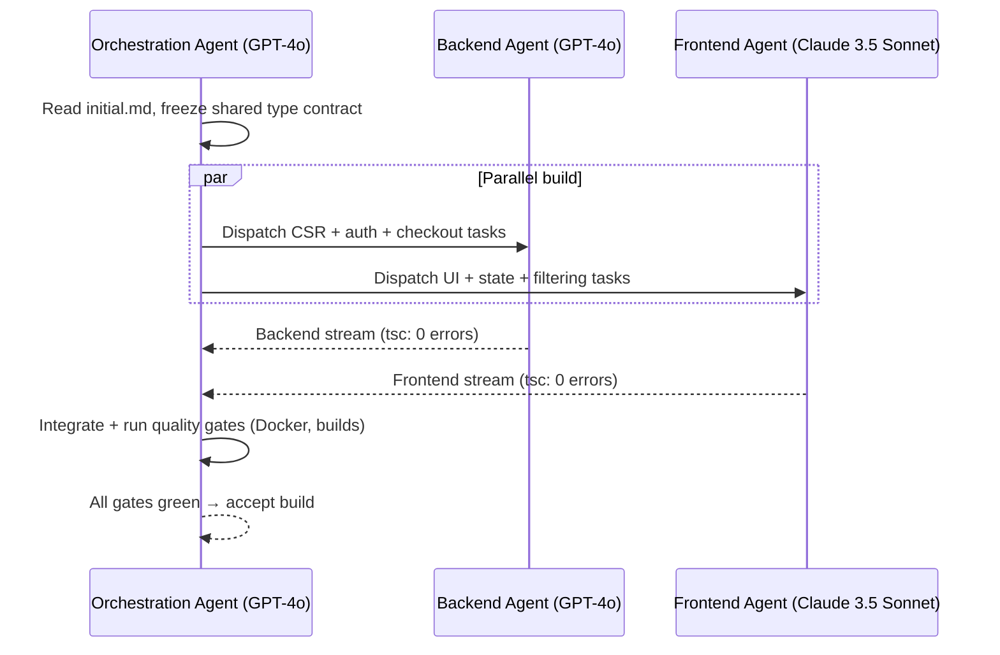

# AI Interactions Log — Aura eCommerce Platform

> **Purpose:** A transparent record of *how* the Aura platform was produced by a multi-agent AI pipeline — which models were used and why, which tools were employed, and the prompt orchestration that drove the build. This is the auditable "make-of" companion to the source code.

---

## 1. Models Used

| Model | Primary Role | Why This Model |
| --- | --- | --- |
| **GPT-4o** | Backend & business-logic code generation (Controller–Service–Repository stack, transactional checkout, JWT/auth, SQL) | Strong **logical reasoning** and rigorous handling of multi-step invariants (atomic checkout, oversell guards, error translation) and strict TypeScript typing. |
| **Claude 3.5 Sonnet** | Premium UI styling & layout (Tailwind composition, Framer Motion choreography, component ergonomics, copy) | Excels at **aesthetic, premium front-end composition** and nuanced layout/animation detail, producing a polished luxury storefront feel. |
| **GPT-4o (Orchestration role)** | Planning, task decomposition, contract freezing, integration & quality-gate enforcement | Reliable at decomposing a large goal into parallelizable streams and reasoning about cross-stream dependencies. |

**Division rationale:** Logic-heavy, correctness-critical code (where a wrong transaction boundary corrupts data) was routed to **GPT-4o**. Taste-heavy, design-critical surfaces (where the bar is visual quality) were routed to **Claude 3.5 Sonnet**. The Orchestration Agent arbitrated the shared type contract so the two streams integrated cleanly.

---

## 2. Tools Utilized

| Tool | Use in the Pipeline |
| --- | --- |
| **Docker / Docker Compose** | Reproducible environment: `mysql:8.0` service with a healthcheck + the API container, wired in `docker-compose.yml`. Enables one-command bring-up and parity between dev and submission. |
| **Git** | Version control across parallel agent streams; per-capability commits; branch isolation so the Backend and Frontend agents could work concurrently without clobbering each other. |
| **TypeScript Compiler (`tsc`)** | The objective quality gate. Both packages must compile under `strict: true` with zero errors before a stream is considered done. |
| **Vite** | Frontend dev server + production build (`tsc -b && vite build`). |
| **ESLint** | Style/lint enforcement of the naming and import conventions defined in the engineering guidelines. |
| **MySQL `init.sql`** | Self-initializing schema + seed executed at startup, so the data layer is deterministic for every agent run. |

---

## 3. Multi-Agent Orchestration — Prompt Log

The following abridged log demonstrates how the **Orchestration Agent** drove the **Backend** and **Frontend** agents through the pipeline defined in `/ai/initial.md`.

### Turn 1 — Bootstrap (Orchestration Agent ← `initial.md`)
> **Prompt:** "Read `/ai/initial.md`. Freeze the shared domain contract before any feature work. Output the type definitions (`User`, `Product`, `Order`, `OrderItem`, `AuthPayload`) and the `{ success, data }` envelope, plus the monorepo scaffold and `init.sql`."
>
> **Result:** Shared `types/index.ts` (both packages), `config/init.sql`, `docker-compose.yml`, `Dockerfile`, `tsconfig` files. Contract frozen and handed downstream.

### Turn 2 — Parallel dispatch (Orchestration Agent → Backend + Frontend)
> **To Backend Agent (GPT-4o):** "Using the frozen types, build the CSR stack. Order: utils (`AppError`, `asyncHandler`, `jwt`) → middleware (`authenticate`, `validate`, `errorHandler`) → repositories → services → controllers/routes. Checkout MUST be one transaction with an oversell guard. Parameterized SQL only."
>
> **To Frontend Agent (Claude 3.5 Sonnet):** "Using the frozen types, build the typed axios clients, `AuthContext`/`CartContext`, the `ui`/`layout` primitives, real-time catalog filtering, and a premium Tailwind + Framer Motion storefront. Token attached via the shared client; session rehydrates via `/auth/me`."

### Turn 3 — Backend deep-dive (Orchestration Agent ↔ Backend Agent)
> **Prompt:** "Show `orderService.checkout` and `orderRepository.createOrder`. Confirm: total computed in the service, order + items + stock decrement + cart clear inside one `withTransaction`, and `INSUFFICIENT_STOCK:<id>` translated to `AppError.conflict`."
>
> **Result:** Atomic checkout verified; stock conflict surfaces as HTTP 409; order history batched to avoid N+1.

### Turn 4 — Frontend deep-dive (Orchestration Agent ↔ Frontend Agent)
> **Prompt:** "Wire `ProtectedRoute` to redirect unauthenticated users. Centralize Framer Motion variants in `lib/motion.ts`. Implement catalog filtering as reactive state with no full-page reload, and `CartDrawer` as an animated overlay."
>
> **Result:** Guarded routes, consistent motion presets, instant client-side filtering, animated cart drawer.

### Turn 5 — Integration & quality gates (Orchestration Agent)
> **Prompt:** "Merge both streams. Run: backend `npm run build`, frontend `tsc -b && vite build`, and `docker-compose up`. Reject if any type error, any unguarded protected route, any string-concatenated SQL, or any `snake_case` domain field leaking into a response."
>
> **Result:** Both builds pass with zero errors; `/api/health` reachable; all gates green. Build accepted.

---

## 4. Force-Multiplier Summary

By **freezing the contract first** and then letting two specialized models build **in parallel** — each playing to its strength — the team produced a coherent, production-grade platform far faster than a single linear pass, with the Orchestration Agent guaranteeing integration correctness.
