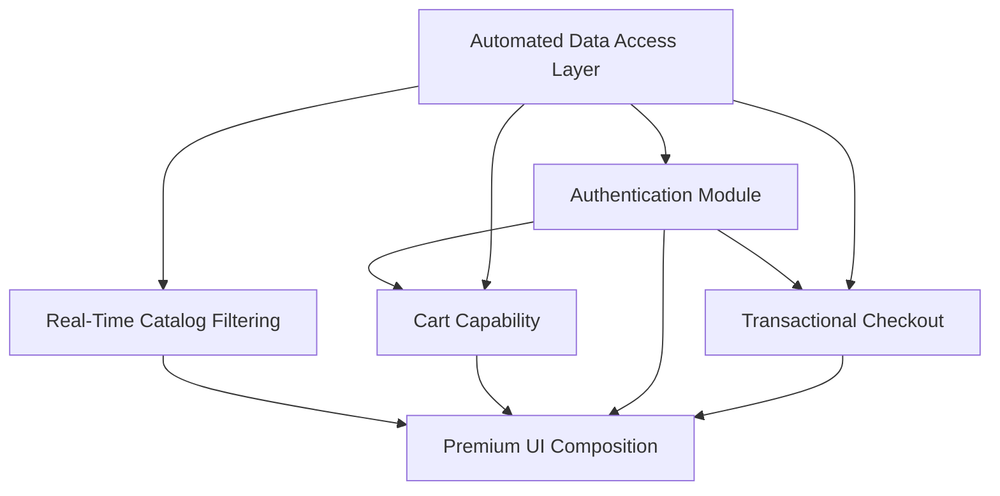

# Capability Definitions — Aura eCommerce Platform

> **Purpose:** A catalog of the reusable functional building blocks ("capabilities") the AI agents compose to assemble the Aura platform. Each capability is a self-contained, independently testable unit with a clear contract, so the Orchestration Agent can assign, parallelize, and recombine them without re-deriving implementation details.

Each capability below lists its **owning agent**, its **surface area**, and the **composition rules** other capabilities rely on.

---

## 1. Authentication Module

**Owner:** Backend Agent · **Surface:** `/api/auth/*`, `middleware/auth.ts`, `utils/jwt.ts`

A complete identity capability covering registration, login, and session retrieval.

- **Register** — validates input, enforces email uniqueness, hashes the password with `bcryptjs`, persists the user, and returns a signed JWT.
- **Login** — verifies credentials against the stored hash (constant-time bcrypt compare) and issues a JWT. Failures return a single generic message (no user-enumeration).
- **Me** — resolves `req.user` (from the verified token) into the current `User` profile, never exposing the password hash.
- **`authenticate` middleware** — the reusable guard any protected route mounts to require `Authorization: Bearer <token>`.

**Composition rule:** Cart and Order capabilities depend on this module; they receive an already-authenticated `userId` and never re-implement identity checks.

---

## 2. Automated Data Access Layer

**Owner:** Backend Agent · **Surface:** `repositories/*.repository.ts`, `config/db.ts`, `config/init.sql`

A uniform, type-safe persistence layer that abstracts MySQL behind domain-shaped methods.

- **Connection pooling** — a single `mysql2/promise` pool (`DB_CONNECTION_LIMIT`) shared across repositories.
- **Schema bootstrap** — `init.sql` provisions `users`, `products`, `cart_items`, `orders`, and `order_items` with foreign keys and seed data; `server.ts` runs it on startup so the database is self-initializing.
- **Parameterized queries** — every statement uses `?` placeholders, eliminating SQL injection by construction.
- **Typed rows** — query results are typed (`RowDataPacket` intersections like `OrderRow`, `ProductRow`) so the compiler enforces the row shape.
- **`withTransaction(fn)`** — a higher-order helper that hands a dedicated connection to a callback, committing on success and rolling back on any throw.

**Composition rule:** Repositories are the **only** capability allowed to touch SQL. Services consume them; controllers never see a query.

---

## 3. Transactional Checkout Composition

**Owner:** Backend Agent · **Surface:** `services/order.service.ts`, `repositories/order.repository.ts`

The platform's most complex capability — turning a cart into a paid order **atomically**.

- **Total computation** — sums `line_total` across detailed cart rows and rounds to 2 decimals in the service layer.
- **Atomic order creation** — inside one `withTransaction`, the repository: (1) inserts the `orders` row, (2) inserts each `order_items` line, (3) decrements `products.stock` with an **oversell guard** (`UPDATE ... WHERE stock >= ?`), and (4) clears the user's `cart_items`. Any failed step rolls back the entire purchase.
- **Stock-conflict translation** — an `INSUFFICIENT_STOCK:<productId>` sentinel thrown by the repository is caught in the service and re-thrown as a user-facing `AppError.conflict`.
- **Order history** — batches line items across multiple orders (single `IN (...)` query) and stitches them back per order, avoiding N+1 reads.

**Composition rule:** Checkout composes the Authentication, Data Access, and Cart capabilities; it is the canonical example of a service orchestrating multiple repositories under one invariant.

---

## 4. Real-Time Catalog Filtering

**Owner:** Frontend Agent (with Backend Agent for `/api/products`) · **Surface:** `frontend/src/api/products.ts`, `data/catalog.ts`, product views

Instant, client-responsive browsing of the product catalog.

- **Typed product API** — `productApi` fetches the catalog and single products through the shared axios client, returning strongly-typed `Product[]`.
- **Live filtering & search** — category and search-term filters are applied reactively in React state so the grid updates as the user types/selects, with no full-page reload.
- **Resilient seed data** — `data/catalog.ts` provides a static catalog so the storefront renders meaningfully even before/without a live backend.

**Composition rule:** Filtering is pure presentation state; it consumes the Data Access layer's product output but adds no persistence of its own.

---

## 5. Premium UI Composition (Tailwind CSS + Framer Motion)

**Owner:** Frontend Agent · **Surface:** `frontend/src/components/**`, `lib/motion.ts`, `lib/utils.ts`, `tailwind.config.js`

A design-system-grade UI layer delivering a luxury storefront feel.

- **Tailwind design tokens** — color, spacing, and typography scales centralized in `tailwind.config.js`; styling is utility-first and composed via `clsx` (`lib/utils.ts`) for conditional class merging.
- **Reusable primitives** — `components/ui` (`Button`, `Input`, `Toast`) provide consistent, accessible building blocks; `components/layout` (`Navbar`, `Footer`, `ScrollToTop`, `PageTransition`, `ProtectedRoute`) provide app chrome.
- **Motion presets** — `lib/motion.ts` centralizes Framer Motion variants (fades, slides, stagger) so animations are consistent and declarative across pages.
- **Page transitions** — `PageTransition` wraps route changes for smooth enter/exit animation; `CartDrawer` slides in as an animated overlay.
- **Global state via Context** — `AuthContext` and `CartContext` expose `useAuth` / `useCart` hooks so any component can read session and cart state without prop drilling.

**Composition rule:** UI primitives are presentation-only and stateless where possible; they receive data and callbacks from context providers and the typed API clients, keeping the visual layer decoupled from data fetching.

---

## Capability Composition Map

